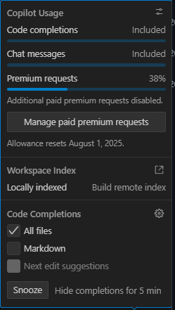

# AI-USAGE.md

## Usage Stats

- Total messages exchanged: 3
- Model used: Gemini 2.5 Pro
- Credits spent: 1%
- GitHub Copilot usage started at: 37%

## Screenshots

Directory: ./screenshots

| Name                                   | Size (bytes) | Last Modified           |
|----------------------------------------|--------------|------------------------|
| ai-usage.png                           | 21705        | 28-07-2025 01:37       |
| ui-Screenshot-2025-07-28 014711.png    | 10808        | 28-07-2025 01:47       |

### Embedded Screenshots

#### 1. UI Screenshot (Browser View of Developed App)
This screenshot shows the browser interface of the application developed in this project.

#### 2. GitHub Copilot Usage Percentage
This screenshot displays the GitHub Copilot usage percentage, which started at 37% for this session.

---

_This file documents the AI usage for this project, including stats and visual references._
